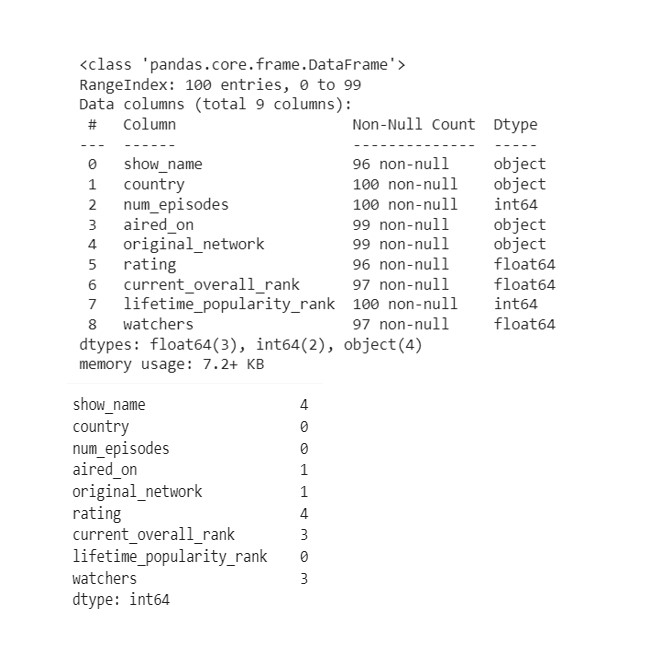
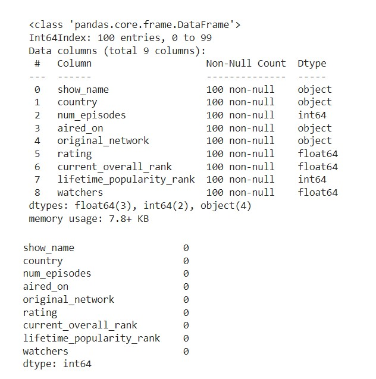
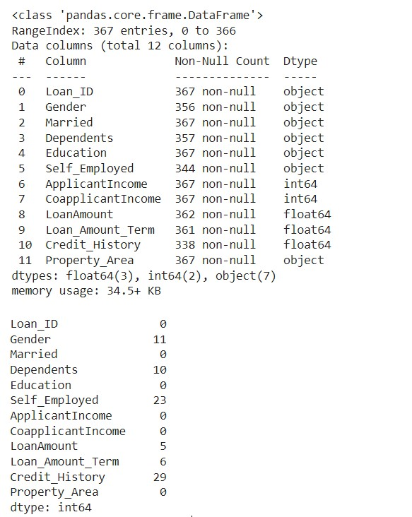
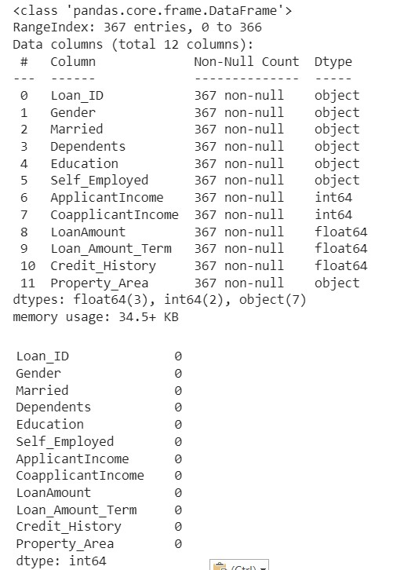

# Ex-01_DS_Data_Cleansing
# AIM
To read the given data and perform data cleaning and save the cleaned data to a file.

# Explanation
Data cleaning is the process of preparing data for analysis by removing or modifying data that is incorrect ,incompleted , irrelevant , duplicated or improperly formatted. Data cleaning is not simply about erasing data ,but rather finding a way to maximize datasets accuracy without necessarily deleting the information.

# ALGORITHM
## STEP 1
Read the given Data

## STEP 2
Get the information about the data

## STEP 3
Remove the null values from the data

## STEP 4
Save the Clean data to the file

# CODE
~~~
#Name:M.Hariharan
#Reg.no:212221230034
#for data set Data_set.csv
import pandas as pd
import numpy as np
import seaborn as sns
df=pd.read_csv("Data_set.csv")
df
df.info()
df.columns
df.isnull().sum()
df['show_name']=df['show_name'].fillna(df['show_name'].mode()[0])  
df['aired_on']=df['aired_on'].fillna(df['aired_on'].mode()[0])
df['original_network']=df['original_network'].fillna(df['original_network'].mode()[0])
df['rating']=df['rating'].fillna(df['rating'].mean())   
df['current_overall_rank']=df['current_overall_rank'].fillna(df['current_overall_rank'].mean())
df['watchers']=df['watchers'].fillna(df['watchers'].median())
df.isnull().sum()
df.info()
~~~

~~~
#for dataset Loan_data.csv
import pandas as pd
import numpy as np
import seaborn as sns
df=pd.read_csv("Loan_data.csv")
df.info()
df.head()
df.isnull().sum()
df['Gender']=df['Gender'].fillna(df['Gender'].mode()[0])
df['Dependents']=df['Dependents'].fillna(df['Dependents'].mode()[0])
df['Self_Employed']=df['Self_Employed'].fillna(df['Self_Employed'].mode()[0])
df['LoanAmount']=df['LoanAmount'].fillna(df['LoanAmount'].mode()[0])
df['Loan_Amount_Term']=df['Loan_Amount_Term'].fillna(df['Loan_Amount_Term'].median())
df['Credit_History']=df['Credit_History'].fillna(df['Credit_History'].median())
df.isnull().sum()
df.info()
~~~
# OUPUT
## For dataset Data_set.csv
### Before Cleaning

### After Cleaning

## For dataset Loan_data.csv
### Before Cleaning

### After Cleaning
